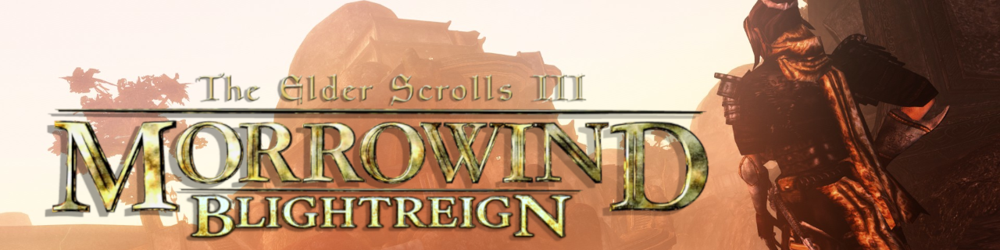

# Blightreign

*Blightreign is my love letter to Morrowind. It keeps the game’s weird, alien world intact while adding subtle improvements, like better audio, updated visuals and small gameplay tweaks. Vanilla at heart, just a little smoother.*

---

## Contents

- [Features](#features)  
- [System Requirements](#system-requirements)  
- [Installation Guide](#installation-guide)  
- [Load Order Library](https://loadorderlibrary.com/lists/blightreign-2)  
- [Credits & Thanks](#credits--thanks)

---

## Features

- Immersive soundscape and updated music to bring Vvardenfell & Solstheim more alive  
- Visual updates with OpenMW shaders, true to vanilla aesthetic  
- Expanded lands: Tamriel Rebuilt, Skyrim: Home of the Nords, Province: Cyrodiil  
- Gameplay refinements like relaxed leveling, sensible attribute-to-skill allocation, magicka regeneration  
- New weapons & armors that feel like they belong in Morrowind’s original style  
- Quality-of-Life mods included for smoother gameplay  
- Balanced visuals + performance; bug, mesh, and texture fixes  
- First person + third person animation improvements; light voice acting for key NPCs  

---

## Installation Guide

### 1. Install or Reinstall Morrowind GOTY  
- If a copy has already been installed, uninstall the game, delete `.ini` files from:  
  `Documents/My Games/Morrowind`  
- Reinstall normally through Steam or GOG.  
- Run the game once to the main menu to generate fresh `.ini` files.  

---

### 2. Install OpenMW 0.49 Release Build  
- Download here: [OpenMW 0.49 Release](https://github.com/OpenMW/openmw/releases/tag/openmw-0.49.0)  
- Run the installer and follow the steps.  
- **Important:** Uncheck *"Import Bitmap Fonts Setup from Morrowind"* when prompted.  

---

### 3. Wabbajack Setup  
- Launch Wabbajack.  
- Open the **Cogwheel** in the bottom left and log into your Nexus account.  

---

### 4. Installing the Modlist  

**Option A: From Wabbajack Gallery**  
- Go to *Browse Lists*, check *Non-featured*, and search for **Blightreign**.  
- Click the download icon.  

**Option B: From a .wabba file**  
- Select *Install from Disk* and set the *Target Modlist Path* to your file.  

**Installation Path:**  
- Choose your installation location (e.g., `C:/Modlists/Blightreign`).  
- Wabbajack will automatically create the downloads directory.  
- Press **Install** to begin.  

---

### 5. Mod Organizer 2 Setup  
- After installation, launch `ModOrganizer.exe` from your Blightreign folder.  
- In the top-right dropdown, select **Edit**.  
- Set binary paths:  
  - **OpenMW:** `openmw.exe`  
  - **OpenMW Launcher:** `OpenMW-Launcher.exe`  
- Both are located in your OpenMW installation folder.  

---

### 6. Time to Play  
- In MO2, select **openmw** from the right-hand dropdown.  
- Press **Run** to start the game.  

---

## Credits & Thanks

Thanks to all the mod authors whose work makes this possible, including:  

- **Tamriel Rebuilt, Skyrim: Home of the Nords, Province: Cyrodiil** teams  
- **OpenMW development team**  
- **Root Builder & OpenMW Player** plugin author  
- All audio, animation, bugfix, and QOL mod contributors  
- The Morrowind modding community
- My homies
